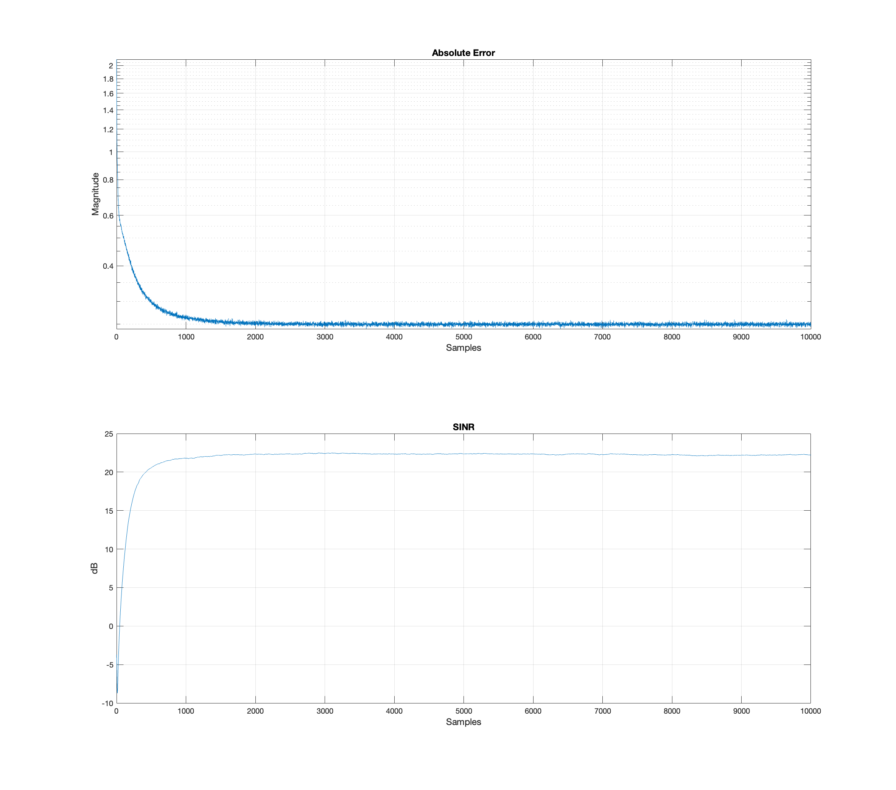

## Adaptive Beamforming Algorithms for Antenna Arrays

### Introduction

#### Constrained Constant Modulus Beamforming Algorithm

The constrained constant modulus (CCM) criterion can be very useful in circumstances where the signal of interest (SOI) is known beforehand. Under these circumstances, a look-direction constraint can be applied allowing the wireless receiver to quickly subtract-out undesirable interference and hone in on the SOI by applying a gain. The CCM criterion is especially powerful in solving this problem due to its simplicity and effectiveness. It simply measures a deviation of the beamformer output from a constant modulus condition and puts a constraint to the array response to the desired signal of interest. 

NOTE: In beamforming (focussing a receiver), the antenna array weights (also called steering vectors) determine how the received signals from different antenna elements are combined to create a beam in a certain direction to allow the desired signal of interest into the resepective receive chain. The "modulus" of a complex number refers to its magnitude or absolute value. Constant modulus means that the magnitude of each weight in the beamforming vector will be a constant value. By maintaining a constant modulus for each weight in the beamforming vector, the beamformer running a CCM beamforming algorithm aims to focus the beam towards the direction of desired signal of interest. It has to be understood that the beamformer weights are iteratively updated to maintain constrained constant modulus criterion in the CCM beamforming algorithm. The CCM criterion is particularly relevant in analog and hybrid beamforming architectures where phase shifters and related components are used to control the antenna weights of the beamformer.

#### Unconstrained Constant Modulus Beamforming Algorithm

In situations where the SOI is not known prior to detection, a wireless receiver array is said to be "blind". Blind adaptive beamforming is an elegant solution to this problem and can be quickly and easily implemented to extract one signal out of many interfering signals plus noise. However, multiple signals must be extracted and subsequently subtracted before the desired signal is found. The constant modulus algorithm (CMA) constraint for beamforming is a natural fit for this problem because it extracts signals from an array output by exploiting the low modulus fluctuation exhibited by most communications signals.

The project work done provides an analysis of the constrained constant modulus beamforming algorithm using Auxiliary Vector Filtering (AVF) for the case when a look-direction of the SOI is already known. An additional analysis of the unconstrained constant modulus beamforming algorithm using a Recursive Least Squares (RLS) approach is provided for the case when the SOI is not known.

### Simulation and Results

#### Constrained Constant Modulus Beamforming Algorithm using Auxiliary Vector Filtering

#### Unconstrained Constant Modulus Beamforming Algorithm using Recursive Least Squares Approach

## Citation

Please note that the code and technical details made available are for educational purposes only. The repo is not open for collaboration.

If you happen to use the code from this repo, please use the below citation to cite. Thank you!

balarcode (2025). *GitHub - balarcode/telecommunications: Practical implementation of selected algorithms, concepts and techniques in the field of telecommunications.* GitHub. https://github.com/balarcode/telecommunications

## Copyright

<a href="https://github.com/balarcode/telecommunications">Telecommunications</a> © 2025 by <a href="https://github.com/balarcode">balarcode</a> is licensed under <a href="https://creativecommons.org/licenses/by-nc-nd/4.0/">CC BY-NC-ND 4.0</a>

