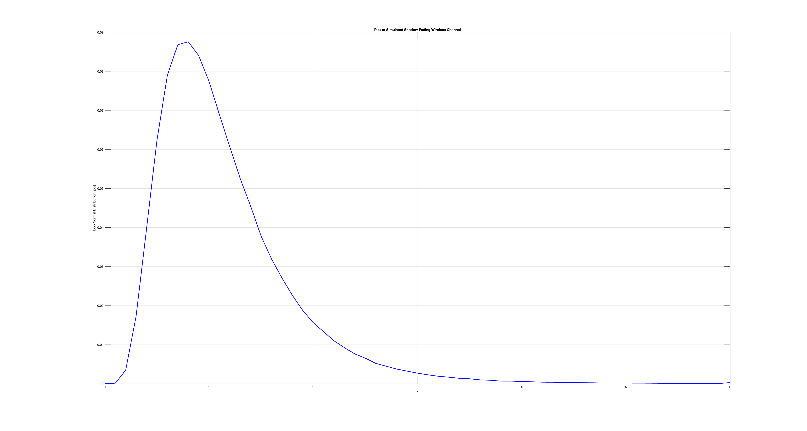
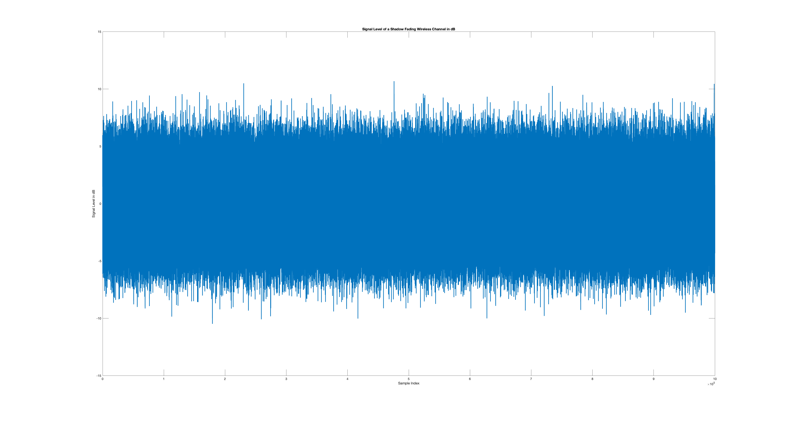
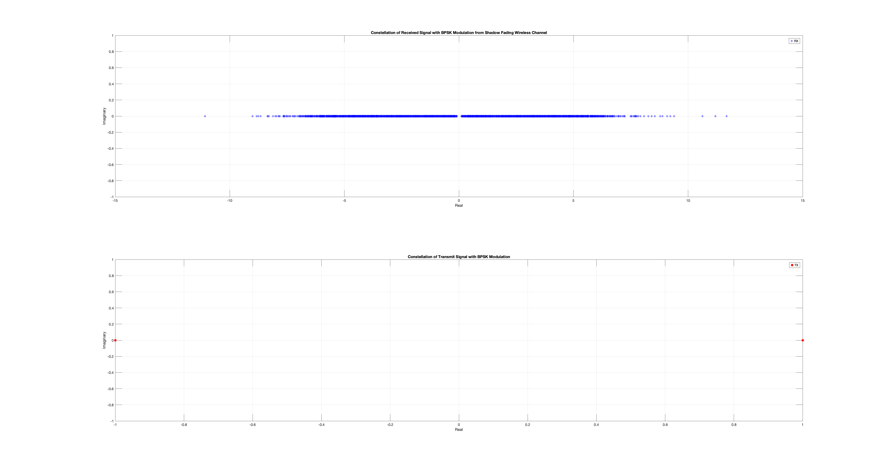

## Rayleigh Fading Wireless Channel

### Plot of Simulated and Theoretical Rayleigh Fading Wireless Channel

### Signal Level of a Rayleigh Fading Wireless Channel in dB

### Autocorrelation Function of Rayleigh Fading Wireless Channel Coefficients

### Signal Constellation from Rayleigh Fading Wireless Channel

## Shadow Fading Wireless Channel

### Plot of Simulated Shadow Fading Wireless Channel

### Signal Level of a Shadow Fading Wireless Channel in dB

### Signal Constellation from Shadow Fading Wireless Channel

