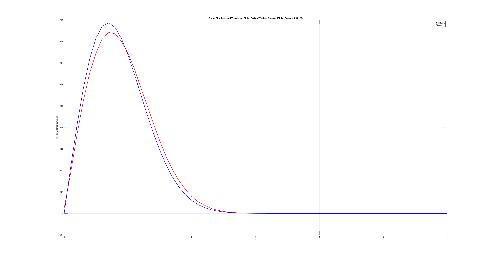
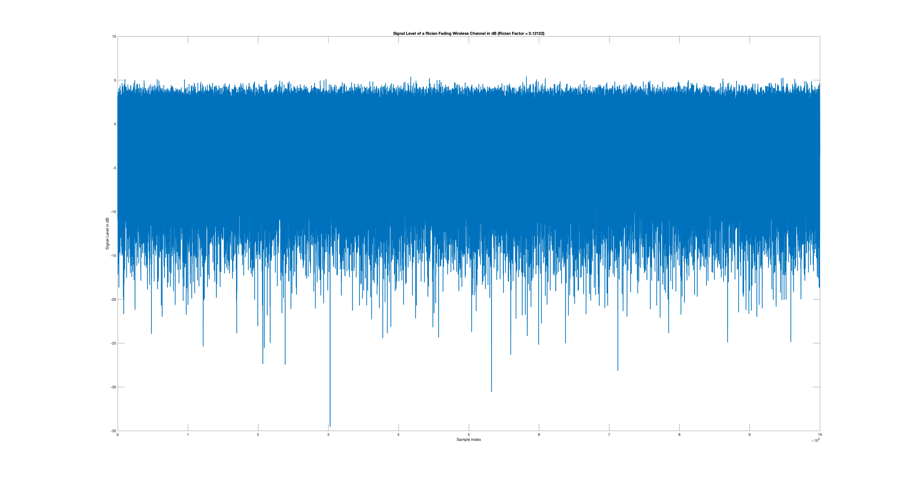
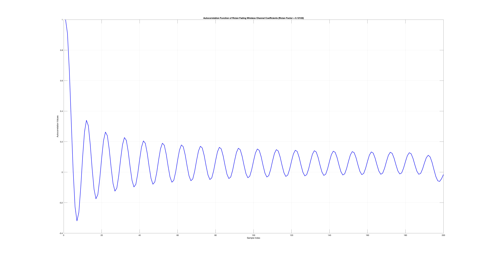

# Wireless Channels

The following wireless channels are simulated for illustration.
1. Rayleigh Fading Wireless Channel
2. Shadow Fading Wireless Channel
3. Rician Fading Wireless Channel

## Rayleigh Fading Wireless Channel

### Plot of Simulated and Theoretical Rayleigh Fading Wireless Channel

### Signal Level of a Rayleigh Fading Wireless Channel in dB

### Autocorrelation Function of Rayleigh Fading Wireless Channel Coefficients

### Signal Constellation from Rayleigh Fading Wireless Channel

## Shadow Fading Wireless Channel

### Plot of Simulated Shadow Fading Wireless Channel

### Signal Level of a Shadow Fading Wireless Channel in dB

### Signal Constellation from Shadow Fading Wireless Channel

## Rician Fading Wireless Channel

### Plot of Simulated and Theoretical Rician Fading Wireless Channel

### Signal Level of a Rician Fading Wireless Channel in dB

NOTE: Rician factor, K << 1 indicates severe fading.

### Autocorrelation Function of Rician Fading Wireless Channel Coefficients

### Signal Constellation from Rician Fading Wireless Channel

## Citation

Please note that the code and technical details made available are for educational purposes only. The repo is not open for collaboration.

If you happen to use the code from this repo, please cite my user name along with link to my profile: https://github.com/balarcode. Thank you!

## Copyright

<a href="https://github.com/balarcode/telecommunications">Telecommunications</a> © 2025 by <a href="https://github.com/balarcode">balarcode</a> is licensed under <a href="https://creativecommons.org/licenses/by-nc-nd/4.0/">CC BY-NC-ND 4.0</a>

