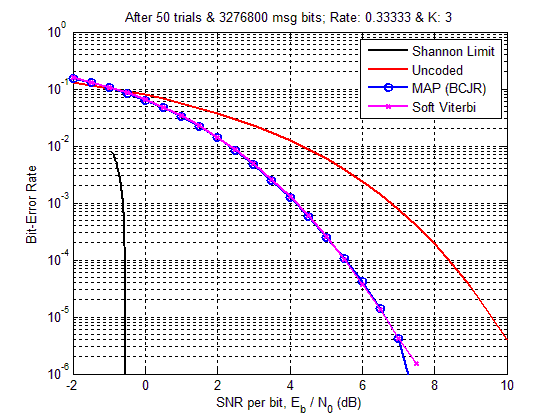

## Maximum A Posteriori Decoding using BCJR Algorithm

### Introduction

Decoding algorithms are a key in the implementation of the outer receiver component of a communication receiver which are used to decode the information sequence or symbol(s) that were transmitted in the physical layer. Maximum A Posteriori (MAP) decoding using BCJR algorithm is an essential component in a Turbo Decoder.

Maximum A Posteriori (MAP) Probability Decoding performs symbol-by-symbol detection for systematic convolutional codes and block codes rather than looking for the most likely input sequence. The BCJR algorithm named after Bahl, Cocke, Jelinek and Raviv (Bahl et al. 1974) is a widely used algorithm to perform MAP decoding. It employs the sum-product algorithm which is used to compute the a-posteriori probability of each symbol (or equivalently each bit if symbol is represented by one bit). When compared to Viterbi algorithm which finds the most likely symbol sequence by minimizing the probability of sequence error, BCJR algorithm is optimal since it minimizes the probability of symbol error. Nevertheless, as stated by Bahl et al., in most applications the performance of the two algorithms will be almost identical.

It is known that convolutional codes can be generated using a linear finite state shift register which has memory blocks to store the bits and as well as generate output bits during each state of operation of the shift register. Consequently, the state transitions due to an input bit resulting in the generation of output and parity bits can be compactly represented in the form of trellis and state diagrams. The BCJR algorithm uses the structure of the trellis to decode each bit transmitted in a coded sequence. In fact, the algorithm computes the probabilities associated with each and every node in the trellis based on the previous, present and next states and computes branch metrics for allowed state transitions in the trellis which are governed uniquely by the generator polynomials of a convolutional code. BCJR algorithm estimates the a-posteriori probabilities of the states and the transitions of a Markov Source observed in the presence of memoryless noise. Different set of generator polynomials yield different trellises and hence the generator polynomials/functions are the ones which define the state transitions in a trellis. It is crucial for both encoder and decoder to operate on the same trellis structure generated by the generator polynomials/functions for a suitable constraint length.

### Simulation Results for BCJR Algorithm

The plots below show the bit error rate (BER) performance of a MAP decoder implemented using BCJR algorithm and compared against a soft Viterbi decoder. It can be seen that both MAP and Soft Viterbi (which performs ML detection) have the same performance. The uncoded bit error rate and Shannon’s limit are also plotted for comparison. The BER performance is plotted for a rate 1/2 and 1/3, constraint length K = 3 and for generator polynomials g(1) = [1 0 0] and g(2) = [1 0 1] for rate 1/2 and g(1) = [1 0 0], g(2) = [1 0 1] and g(3) = [1 1 1] for rate 1/3.

### BER Performance for a Rate 1/2 Systematic Convolutional Code

### BER Performance for a Rate 1/3 Systematic Convolutional Code

