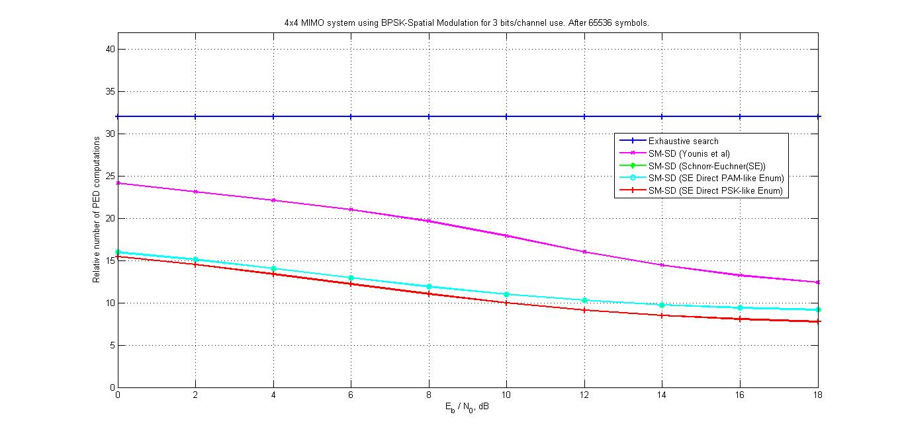
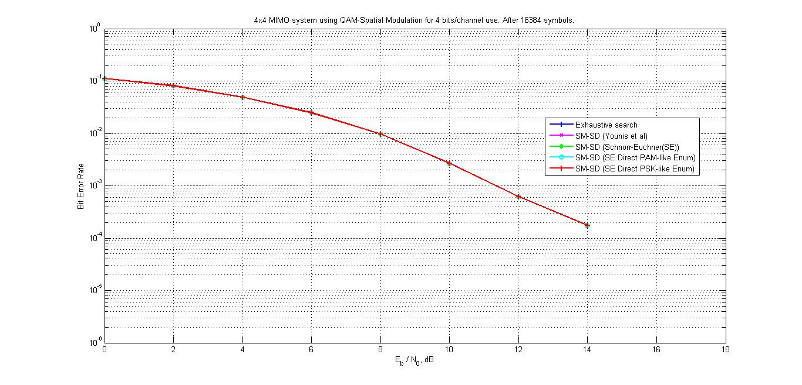
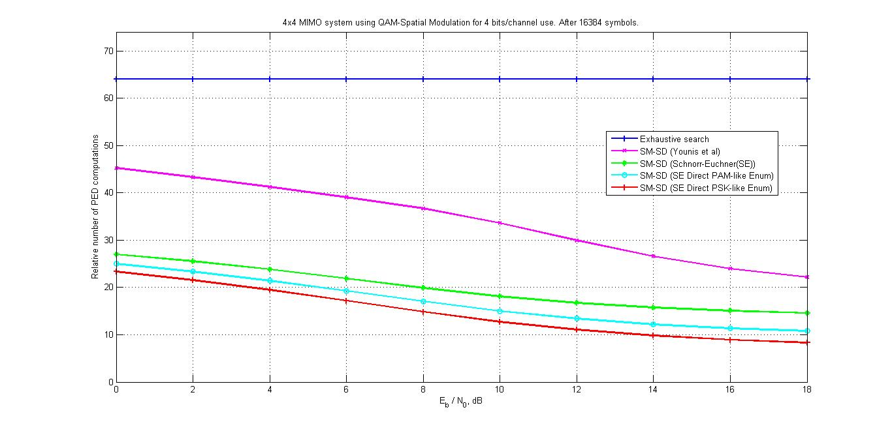
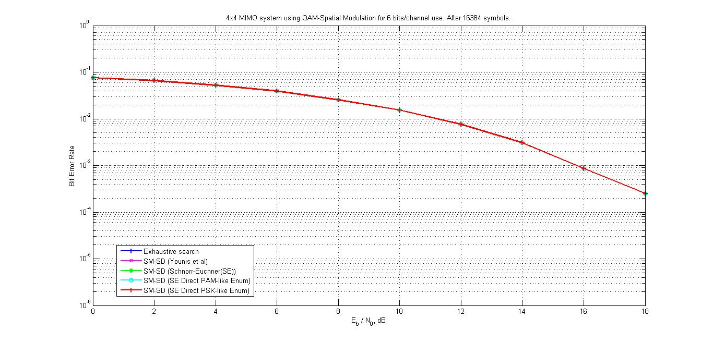
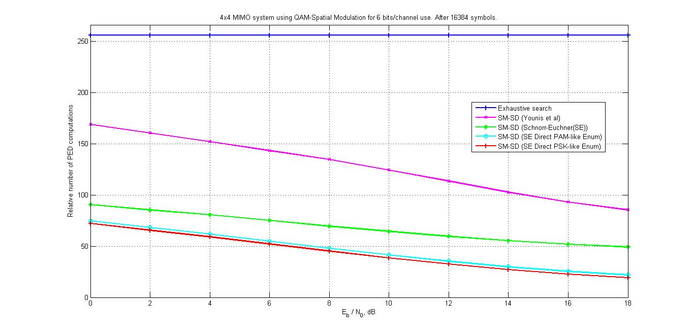

## MIMO Wireless Receiver Optimal Detection Algorithms & Performance Analysis

### Introduction

Spatial Modulation (SM) transmission technology for Multiple-Input Multiple-Output (MIMO) wireless systems avoid Inter-Channel Interference (ICI) and require no synchronization between the transmitting antennas while maintaining high spectral efficiency. One of the main challenges in MIMO wireless systems is to design low-complexity high-throughput detectors (involving algorithms + architecture) which are suitable for efficient VLSI implementation. Three sphere decoding algorithms that perform Maximum Likelihood (ML) estimation for single-antenna spatial modulation systems that result in reduced number of metric computations and lesser number of visited nodes are shown here in comparison with exhaustive search based sphere decoding algorithm and Rx-SD based sphere decoding algorithm. All sphere decoding algorithms that are designed and developed achieve optimal ML performance. In particular, the three sphere decoding algorithms provide an efficient design for VLSI implementation.

### Simulation Results

#### BPSK Spatial Modulation

#### 4-QAM Spatial Modulation

#### 16-QAM Spatial Modulation

## Citation

Please note that the code and technical details made available are for educational purposes only. The repo is not open for collaboration.

If you happen to use the code from this repo, please cite my user name along with link to my profile: https://github.com/balarcode. Thank you!
