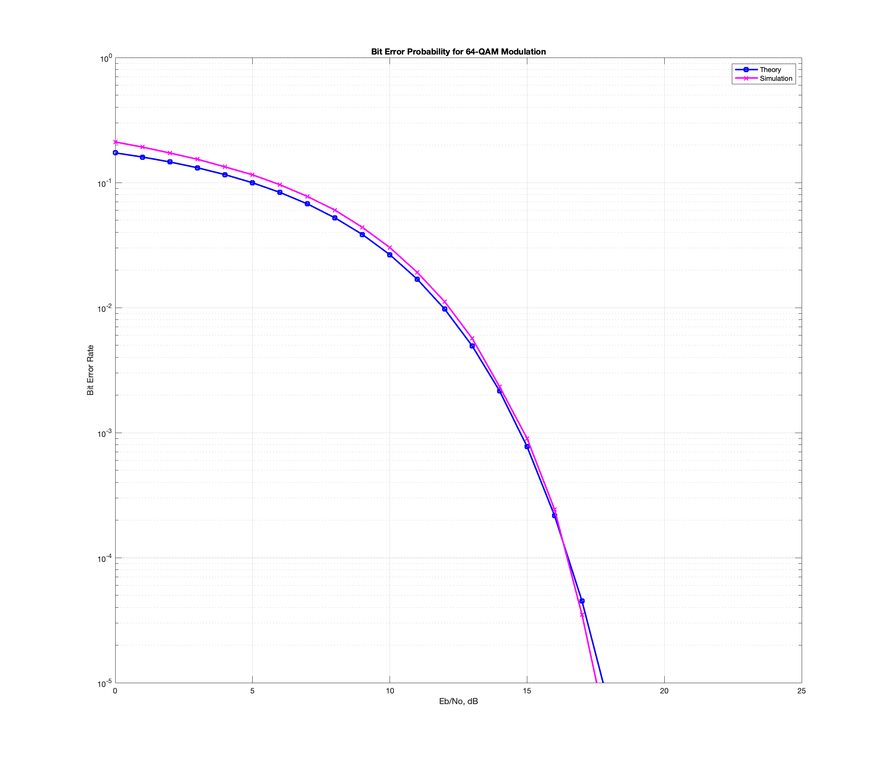

## Power Spectral Density for 4-QAM Modulation

## Comparison of Power Spectral Densities between MSK and 4-QAM Modulation Schemes

## Bit Error Rate for 64-QAM Modulation

## Constellation for 64-QAM Modulation

